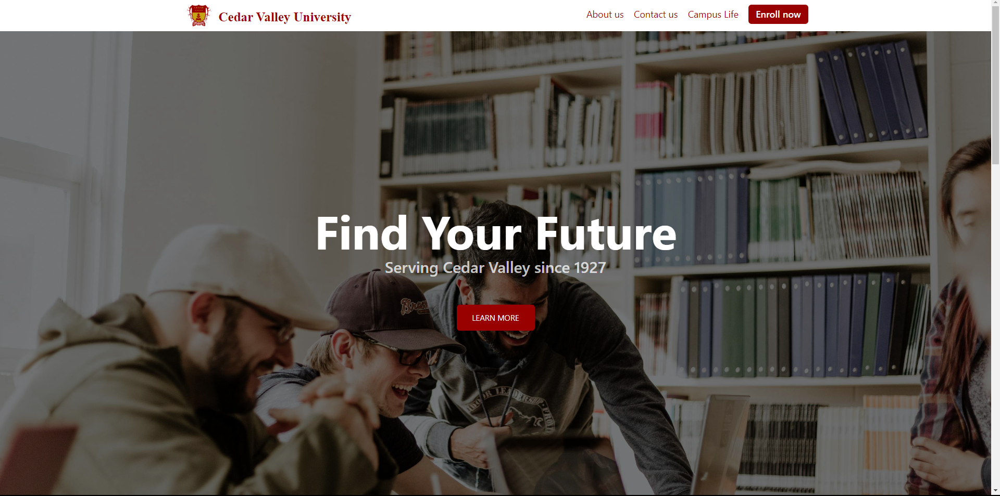
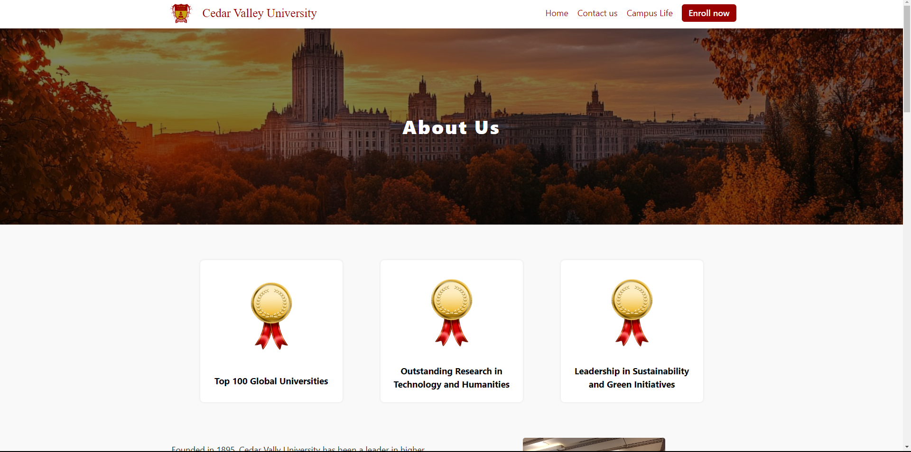
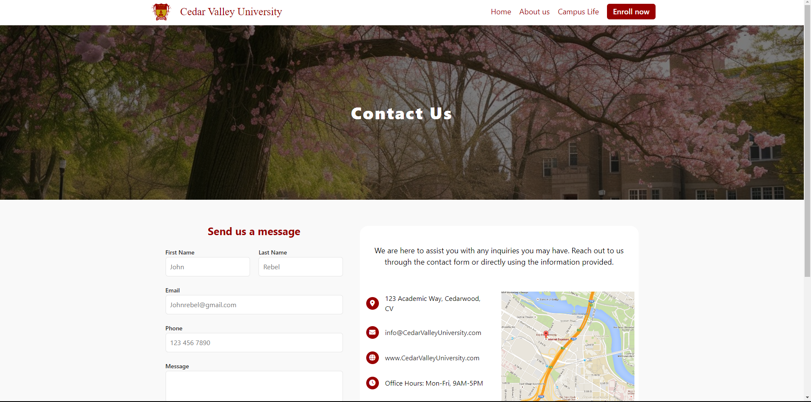

# Cedar Valley University Website

This project is a website for a fictional university, Cedar Valley University.
The site includes three main sections: the home page, which highlights the
university's programs, recent news, and events; the "About Us" page, which
provides a detailed history of the university, its mission, and its global
impact; and the "Contact Us" page, offering important contact details and links 
to resources. The website is built using HTML and CSS, focusing on clean design, easy navigation, and responsive layouts to ensure a user-friendly experience across different devices.

## Website Features

This website for Cedar Valley University includes features that make it easy to use and accessible on all devices. The design adapts smoothly to different screen sizes, whether you're on a computer, tablet, or smartphone, making sure users always have a great experience. The site is built with HTML and CSS, focusing on creating a simple but effective layout. It provides clear information about the university, its programs, and how to get in touch, all organized in a way that's easy to navigate. The project highlights attention to detail in making sure the website looks good and functions well across various platforms.

## Technologies Used to Build The Website

* HTML: Used for structuring the entire website, including sections like the homepage, About Us, and Contact pages, ensuring proper organization and accessibility.

* CSS: Responsible for the styling, layout, and responsiveness, making sure the design adapts seamlessly across different screen sizes, from desktop to mobile.

* Google Fonts: Integrated to provide modern and clean typography for better * readability.

* Font Awesome: Utilized for icons, including the hamburger menu and social media icons, enhancing user interaction.

* CSS Reset: Ensures a consistent look across various browsers by eliminating default styling inconsistencies.

* Functioning Hamburger Menu: Built using only HTML and CSS, the menu works without JavaScript, making it lightweight and easy to use on mobile devices.

* Basic Carousel: A simple, functional carousel that displays review for the fake university

### Credits

Thanks so much to the following people for their help and collaboration on this project:

* [Myles Reid](https://github.com/myles-reid)

* [Dave Sommerville](https://github.com/dave-sommerville)

* [Oluwajuwon Shuaibu](https://github.com/mrshuaibu)

